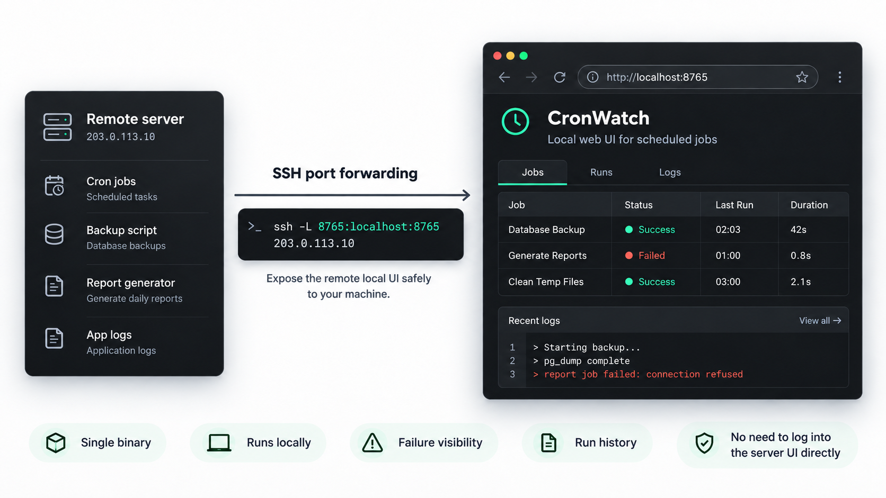
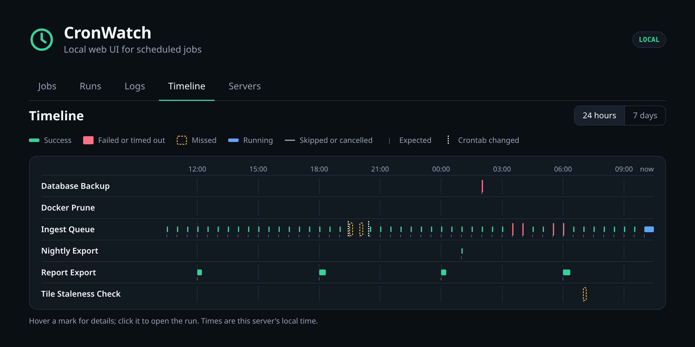

# CronWatch

**Know what ran, what failed, and what never started.**

CronWatch wraps scheduled commands and records their results in a local SQLite
database. A small web dashboard shows job status, run history, duration, and
captured logs. It ships as one Go binary and needs no account or daemon to
record runs.



[Install](#install) · [Quick start](#quick-start) · [CLI](#cli) · [Development](#development)

## Highlights

- **Drop-in command wrapper.** Add `cronwatch run` to an existing cron entry.
- **Useful failure detail.** Capture stdout, stderr, exit codes, and duration.
- **Works here, fails in cron?** Each run records its environment, so
  `cronwatch envdiff` shows what cron's `PATH`, shell, or directory lacks, and
  `cronwatch try` reruns the job the way cron ran it.
- **Missed-run detection.** A five-field cron schedule and grace period show
  when a job did not start on time.
- **Failures your exit codes miss.** Mark runs failed when output matches a
  pattern or a run takes too long, and keep overlapping runs from piling up.
- **Alerts without new dependencies.** Run any command when a job starts
  failing or recovers, or let cron email you a daily `cronwatch digest`.
- **Local by default.** SQLite storage and a dashboard bound to
  `127.0.0.1:8765`; SSH forwarding covers remote servers.
- **Single binary.** HTML, CSS, JavaScript, and database migrations are embedded.

## Install

The installer downloads the latest release for Linux or macOS, checks its
SHA-256 digest, and installs CronWatch into `~/.local/bin` without sudo:

```sh
curl -fsSL https://github.com/yeboahd24/cronwatch/releases/latest/download/install.sh | sh
```

Set `CRONWATCH_INSTALL_DIR` to choose another user-owned directory. Ensure the
install directory is on your `PATH`.

To build from source instead, use Go 1.26 or newer:

```sh
go build -o cronwatch ./cmd/cronwatch
```

## Quick start

Wrap a command and start the dashboard:

```sh
cronwatch run --name "Database Backup" --schedule "0 2 * * *" --grace 10m -- ./backup.sh
cronwatch serve
```

Open <http://localhost:8765>. A command that exits nonzero also makes
`cronwatch run` exit with that code, so existing cron behavior is preserved.

For a remote server, keep the dashboard on its default loopback address and
forward the port from your workstation:

```sh
ssh -L 8765:localhost:8765 user@server
```

Then open <http://localhost:8765> on the workstation. The browser can inspect
jobs and logs; it cannot execute commands.

### Dashboard

- **Jobs** lists every job with its status, last run, duration, and next
  expected run, and refreshes every 10 seconds. Below it, **Recent logs** shows
  the end of the latest failing run's output (or the latest run when nothing
  is failing). Lines the command wrote to stderr are shown in red.
- **Runs** lists recent runs across all jobs. A run's page shows its last error,
  and its output opens at the end, with All / Stdout / Stderr views. Below the
  output is the environment the run started in. When a run fails and its
  environment differs from the last successful run's, a notice at the top
  lists what changed. A failed run also has a **vs last success** view: the
  lines that are new in this run, the lines from the last success that are
  missing, and how the exit code and duration changed. Lines are matched
  ignoring numbers, times, IDs and `/tmp` paths, so a changed date or size is
  not reported as a difference.
- **Durations.** The jobs list and each job's page show a bar chart of recent
  run durations. A successful run that takes more than 3× the median of the
  job's previous 20 successful runs (and at least 10 seconds longer) is marked
  **slow**. A job's page also says when it is **getting slower**: its median
  over the last 7 days is 40% or more above the 30 days before (and at least
  10 seconds more).
- **Failure types.** Failed runs that end with the same error are grouped, by
  their last few stderr lines (or output, if stderr is empty) with numbers,
  times, IDs and `/tmp` paths ignored. A failed run's page says whether its
  error is **new** or how many earlier runs failed the same way and when it
  was first seen; a job's page lists each failure type with its count, first
  and last time.
- **Logs** searches the output of the last 50 runs; **Errors only** limits
  results to stderr lines.
- **Timeline** shows every job's runs over the last 24 hours or 7 days, one row
  per job, with expected run times and missed runs, so failures, gaps and jobs
  that run at the same time stand out. Hover a mark for details; click it to
  open the run.

A run's page also shows why a run counts as failed when its exit code alone
does not say (see [Deciding success](#deciding-success)), its peak memory and
CPU time, and whether it started while an earlier run was still going.




### Cron example

Take an existing cron entry:

```cron
0 2 * * * /opt/scripts/backup.sh
```

and put `cronwatch run ... --` in front of the command:

```cron
0 2 * * * $HOME/.local/bin/cronwatch run --name "Database Backup" --schedule "0 2 * * *" --grace 10m -- /opt/scripts/backup.sh
```

The line has two schedules, and they do different jobs:

```text
0 2 * * *  $HOME/.local/bin/cronwatch run  --name "Database Backup"  --schedule "0 2 * * *"  --grace 10m  --  /opt/scripts/backup.sh
└───┬───┘  └─────────────┬──────────────┘  └──────────┬───────────┘  └─────────┬──────────┘  └────┬────┘  │   └─────────┬──────────┘
    1                    2                            3                        4                  5       6             7
```

1. **Cron's schedule.** Cron reads this to decide *when to run* the line:
   02:00 every day. CronWatch does not change it.
2. **The wrapper.** Cron starts CronWatch, which starts your command and
   records the result. Use the full path, because cron's `PATH` is minimal.
3. **The job name** shown on the dashboard.
4. **CronWatch's copy of the schedule.** It tells CronWatch *when to expect a
   run*, so it can show the next expected time and flag a run that never
   started. Keep it identical to (1).
5. **Grace period.** How late a run may start before it counts as missed.
   Default 5m.
6. **`--`** ends CronWatch's flags; everything after it is your command.
7. **Your command**, exactly as it was before.

You can leave out `--schedule`: while `cronwatch serve` is running, it reads
your crontab and takes the schedule from (1). Pass `--schedule` when you don't
run `serve`, or when you want the expectation written next to the command.

Shell redirects after the command still work, because CronWatch passes the
command's output through:

```cron
0 2 * * * $HOME/.local/bin/cronwatch run --name "Database Backup" -- /opt/scripts/backup.sh >> $HOME/backup.log 2>&1
```

The cron entry and dashboard must run under the same user to see the same
database. A user-level systemd service example is in
[`examples/cronwatch.service`](examples/cronwatch.service).

## CLI

| Command | Purpose |
| --- | --- |
| [`cronwatch run`](#cronwatch-run) | Run a command and record the result |
| [`cronwatch serve`](#cronwatch-serve) | Serve the local dashboard |
| [`cronwatch jobs`](#cronwatch-jobs) | List jobs and their current status |
| [`cronwatch runs`](#cronwatch-runs) | List recent runs |
| [`cronwatch sync`](#cronwatch-sync) | Register jobs from your crontab before they run |
| [`cronwatch envdiff`](#cronwatch-envdiff) | Compare a run's environment with your shell |
| [`cronwatch try`](#cronwatch-try) | Rerun a job in the environment cron gave it |
| [`cronwatch digest`](#cronwatch-digest) | Summarize every job, for a daily email |
| [`cronwatch prune`](#cronwatch-prune) | Delete old finished runs |
| [`cronwatch version`](#cronwatch-version) | Print the version |

Run `cronwatch COMMAND --help` (or `cronwatch help COMMAND`) for a command's
flags. Every command except `version` accepts `--data-dir DIR` to choose the
database directory. The `CRONWATCH_DATA_DIR` environment variable sets the default,
which is otherwise `~/.config/cronwatch` on Linux. Flags go before any
positional argument, e.g. `cronwatch runs --data-dir DIR database-backup`.

### `cronwatch run`

```sh
cronwatch run --name NAME [flags] -- command [args...]
```

Runs the command, shows its output as usual, and records the run. CronWatch
exits with the command's exit code, so cron and scripts see the same result as
before.

```console
$ cronwatch run --name "Database Backup" --schedule "0 2 * * *" --grace 10m -- /opt/scripts/backup.sh
Dumping database...
Backup written to /backups/db.sql.gz
```

| Flag | Meaning |
| --- | --- |
| `--name NAME` | Job name shown on the dashboard. Required. |
| `--slug SLUG` | Stable ID for the job. Defaults to the name in lowercase with dashes (`database-backup`). |
| `--schedule "EXPR"` | Five-field cron expression CronWatch should expect the job on. |
| `--grace DURATION` | How late a run may start before it counts as missed, e.g. `10m`. Default `5m`. |
| `--max-log-bytes N` | Output kept per stream. Default 1 MiB, maximum 64 MiB. |
| `--no-echo` | Record output without also printing it. |
| `--ok-codes 3,4` | Exit codes besides 0 that count as success. |
| `--fail-on-stderr` | Mark the run failed if the command writes anything to stderr. |
| `--fail-if-match REGEXP` | Mark the run failed if its output matches, e.g. `'ERROR\|Traceback'`. |
| `--success-if-match REGEXP` | Mark the run failed unless its output matches, e.g. `'Backup complete'`. |
| `--timeout DURATION` | Stop the command after this long (SIGTERM, then SIGKILL 5s later) and record `timeout`. |
| `--strict-exit` | Exit 0 for a successful run and nonzero for a failed one, even when the rules above disagree with the command's exit code. |
| `--no-overlap` | Skip the run, and record it as `skipped`, if the job's previous run is still running. |
| `--on-failure 'CMD'` | Shell command to run when the job starts failing. See [Notifications](#notifications). |
| `--on-recover 'CMD'` | Shell command to run when the job succeeds again after failing. |

`--schedule` and `--grace` only change the stored job when you pass them, so
running a job by hand to test it does not reset its schedule.

When output exceeds `--max-log-bytes`, CronWatch keeps the first and last half
and replaces the middle with a marker, so the error at the end of a failing job
is kept. Treat stored logs as sensitive: command output may contain secrets.

Each run also records the environment it started in: the working directory,
the user, the names of all environment variables, and the values of `PATH`,
`HOME`, `SHELL`, `USER`, `LOGNAME`, `TZ`, `TMPDIR`, `LANG`, `LANGUAGE` and
`LC_*`. Other values are not stored, because they may hold secrets. Identical
environments are stored once.

Different names that produce the same slug share one job; CronWatch prints a
warning when that happens, and `--slug` keeps them apart.

Each run also records its peak memory and CPU time.

#### Deciding success

Many scripts exit 0 when they fail. `--ok-codes`, `--fail-on-stderr`,
`--fail-if-match` and `--success-if-match` let the output decide instead.
Patterns are matched against stdout and stderr as captured, so with a small
`--max-log-bytes` a match in the dropped middle is missed. When a rule marks a
run failed, CronWatch prints why on stderr, and the run page shows it:

```console
$ cronwatch run --name "Database Backup" --fail-if-match 'ERROR' -- ./backup.sh
ERROR: disk full
cronwatch: failed: output matched --fail-if-match "ERROR": ERROR: disk full
```

By default `cronwatch run` still exits with the command's own code, so cron
behaves exactly as before. Add `--strict-exit` to make the exit code follow the
recorded status instead.

`--timeout` records the run as `timeout` and exits with the command's code
(143 for SIGTERM). `--no-overlap` exits 0 when it skips a run.

CronWatch notices overlapping runs even without `--no-overlap`: a run that
starts while the job's previous run is still going is marked on its page and
outlined on the timeline.

#### Notifications

`--on-failure` runs a shell command when a job goes from OK to failing: a
failed run, a timeout, or a missed scheduled run. `--on-recover` runs one when
it succeeds again. A job that keeps failing alerts once, not on every run. The
command gets the details in environment variables:

| Variable | Value |
| --- | --- |
| `CRONWATCH_EVENT` | `failed`, `timeout`, `missed` or `recovered` |
| `CRONWATCH_JOB_NAME`, `CRONWATCH_JOB_SLUG` | The job |
| `CRONWATCH_STATUS`, `CRONWATCH_EXIT_CODE` | The run's status and exit code |
| `CRONWATCH_REASON` | Why a rule marked the run failed, if one did |
| `CRONWATCH_LAST_ERROR` | The last line the command wrote to stderr |
| `CRONWATCH_RUN_ID`, `CRONWATCH_STARTED_AT` | The run, for `/runs/RUN-ID` on the dashboard |
| `CRONWATCH_EXPECTED_AT` | For `missed`: when the run was due |
| `CRONWATCH_HOST` | This machine's hostname |

To alert on every job, set `CRONWATCH_ON_FAILURE` (and `CRONWATCH_ON_RECOVER`)
at the top of your crontab instead of repeating the flag. A flag on a line
takes precedence. Cron does not expand variables in these assignments, so the
`$CRONWATCH_…` references reach the hook as written and are filled in when it
runs. On a command line, single-quote the hook for the same reason, and escape
any `%` as `\%`, because cron treats `%` in a command as a newline.

```cron
CRONWATCH_ON_FAILURE=curl -fsS -d "$CRONWATCH_JOB_NAME $CRONWATCH_EVENT: $CRONWATCH_LAST_ERROR" https://ntfy.sh/my-cron-alerts
```

Hooks run after the result is recorded, with a 30-second limit. A hook that
fails or times out is reported on stderr and never changes the job's result.
Missed runs are detected by `cronwatch serve` (or `jobs`, `runs`, `prune`), so
their alerts need one of those running.

### `cronwatch serve`

```sh
cronwatch serve [--addr 127.0.0.1:8765]
```

Serves the dashboard at <http://127.0.0.1:8765>. It is read-only and has no
login, so it only listens on loopback; reach it from another machine with
`ssh -L 8765:localhost:8765 user@server`. Binding to another address requires
`--public`. While running, it also registers jobs from your crontab
([crontab sync](#crontab-sync)) and checks for missed runs every minute,
running `--on-failure` hooks for jobs that start missing runs.

```console
$ cronwatch serve
CronWatch UI: http://127.0.0.1:8765
crontab sync: added Database Backup
crontab sync: added Ingest queue
```

It keeps running until you stop it; the `crontab sync` lines appear when new
crontab lines are registered.

To start it at boot from cron:

```cron
@reboot /usr/bin/flock -n $HOME/.cache/cronwatch-serve.lock $HOME/.local/bin/cronwatch serve >> $HOME/.cache/cronwatch-serve.log 2>&1
```

### `cronwatch jobs`

Lists every job with its current status:

```console
$ cronwatch jobs
NAME              STATUS     LAST RUN          DURATION
Database Backup   success    2026-10-02 02:00  42s
Generate Reports  failed     2026-10-02 01:00  800ms
Queue worker      never_run  —                 —
```

Statuses: `success`, `failed`, `timeout`, `running`, `cancelled`, `skipped`
(by `--no-overlap`), `missed` (a scheduled run never started), `never_run`, and
`invalid_schedule`.

### `cronwatch runs`

Lists the 100 most recent runs, optionally for one job by its slug:

```console
$ cronwatch runs database-backup
RUN ID                            JOB              STATUS   STARTED
9b56e10bd024da121ddce143fd49270c  Database Backup  success  2026-10-02 02:00:01
```

Open a run's output on the dashboard at `/runs/RUN-ID`.

### `cronwatch sync`

```sh
cronwatch sync [--crontab FILE]
```

Registers the jobs in your crontab (`crontab -l`, or `FILE`) so they appear on
the dashboard before their first run, and lists lines that are not monitored:

```console
$ cronwatch sync
Added    Queue worker

2 jobs in the crontab, all registered.

Not monitored (1 line without cronwatch run):
  line 3: 30 4 * * 0 docker system prune -f
```

When everything is covered it prints
`8 jobs in the crontab, all registered. Every crontab line is monitored.`
`cronwatch serve` runs the same sync every minute, so you rarely need this by
hand. See [crontab sync](#crontab-sync).

### `cronwatch envdiff`

```sh
cronwatch envdiff [--last-success] [--all] JOB-SLUG
cronwatch envdiff [--last-success] [--all] --run RUN-ID
```

Explains why a command works in your shell but fails under cron. It compares
the environment of the job's latest run (or `--run`) with the shell you run
`envdiff` in:

```console
$ cronwatch envdiff database-backup
Comparing run 0486399e (2026-10-02 02:00, failed) of Database Backup with this shell.

PATH
  run:   /usr/bin:/bin
  shell: /home/me/.local/bin:/usr/local/bin:/usr/bin:/bin
  Missing from run: /home/me/.local/bin, /usr/local/bin
SHELL
  run:   /bin/sh
  shell: /usr/bin/zsh
Set only in shell: NVM_DIR, SSH_AUTH_SOCK
Set only in run: MAILTO
41 terminal or desktop session variables not shown (--all lists them).

Values of other variables are not recorded, so changes to them are not shown.
```

`--last-success` compares the run with the job's last successful run instead,
which shows what changed when a job that used to work starts failing.
Variables whose values are not recorded are compared by name only.

### `cronwatch try`

```sh
cronwatch try [--env NAME=VALUE]... JOB-SLUG
cronwatch try [--env NAME=VALUE]... --run RUN-ID
```

Runs the job's command now, from your terminal, in the environment of its
latest run: the same working directory and only the recorded variables, with
the command looked up on that run's `PATH`. Use it to reproduce a cron failure
and to check a fix without waiting for the next scheduled run:

```console
$ cronwatch try database-backup
cronwatch: trying Database Backup with the environment of run 0486399e (2026-10-02 02:00, failed)
cronwatch: directory /home/me, PATH=/usr/bin:/bin
cronwatch: not set, because their values are not recorded: MAILTO
cronwatch: backup.sh: command not found with this PATH
```

A job that has no recorded run yet gets cron's defaults (`PATH=/usr/bin:/bin`,
`SHELL=/bin/sh`, the home directory). The run is not recorded, and `try` exits
with the command's exit code. Variables whose values are not recorded, such as
ones set at the top of the crontab, are not set. Pass any the job needs with
`--env NAME=VALUE` (repeatable); `FOO=bar cronwatch try` does not work,
because `try` replaces the environment.

### `cronwatch digest`

```sh
cronwatch digest [--since DURATION] [--quiet]
```

Prints a plain-text summary: the jobs that need attention now, and each job's
runs, failures and missed runs over the period (default `24h`):

```console
$ cronwatch digest
CronWatch digest for nebula-rain, Oct 4 11:24 to Oct 5 11:24

Needs attention (2)
  Database backup: failed Oct 5 02:00 (exit 1)
  Tile staleness check: missed the run expected Oct 5 07:00

JOB                   STATUS   RUNS  FAILED  MISSED  LAST RUN
Database backup       failed   1     1       0       Oct 5 02:00
Docker prune          success  0     0       0       Oct 4 04:30
Ingest queue          running  46    4       2       Oct 5 11:00
Report export         success  4     0       0       Oct 5 06:00
Tile staleness check  missed   0     0       1       Oct 3 07:00
```

Cron emails a job's output to `MAILTO`, so a crontab line is enough for a daily
report. With `--quiet` it prints nothing, and cron sends nothing, unless a job
failed, timed out or missed a run in the period, or is failing now:

```cron
MAILTO=you@example.com
0 8 * * * $HOME/.local/bin/cronwatch digest --quiet
```

### `cronwatch prune`

```sh
cronwatch prune [--keep N] [--older-than DURATION]
```

Deletes finished runs: `--keep N` keeps the newest N per job, and
`--older-than` deletes runs and missed-run records older than a duration
(`720h` is 30 days). At least one is required. Running runs are never deleted.

```console
$ cronwatch prune --keep 200 --older-than 720h
Deleted 37 runs and 2 missed occurrences.
```

### `cronwatch version`

```console
$ cronwatch version
v0.2.2
```

## Crontab sync

`cronwatch serve` reads your crontab (`crontab -l`) at startup and every
minute, and registers every job a line runs through `cronwatch run`. Jobs
appear on the dashboard as **Never run**, with their next expected time,
before their first run. A line without `--schedule` uses its own cron
schedule. Sync never deletes jobs, and it only corrects the schedule, grace
period and hooks of existing jobs; names and commands come from real runs.
Hooks come from the line's flags, or else from `CRONWATCH_ON_FAILURE` and
`CRONWATCH_ON_RECOVER` in the crontab; removing those removes the hooks.

Run `cronwatch sync` to do the same by hand. It also lists crontab lines that
are not wrapped with `cronwatch run`, so you can see what is not monitored.
Pass `--sync-crontab=false` to `serve` to turn this off.

## Retention

CronWatch does not delete runs on its own. Schedule `prune` to bound the
database, for example keeping the latest 200 runs per job and nothing older
than 30 days:

```cron
30 3 * * * $HOME/.local/bin/cronwatch prune --keep 200 --older-than 720h
```

Running runs are never pruned. `--older-than` also removes old missed-run
records.

## How missed runs work

CronWatch compares the configured schedule with recorded run start times. Once
an expected start passes its grace period, it is recorded as missed if no run
started between it and the next expected start. Every missed occurrence is
recorded, not just the latest. A job shows **missed** until a run starts.
Missed occurrences are tracked separately from command executions, so a
command that never started is not reported as a failed process. Schedules
follow the server's local time zone.

Detection runs every minute while `cronwatch serve` is running, and each time
`cronwatch jobs`, `runs`, or `prune` is invoked. Changing a job's schedule
starts detection from that moment. A cron expression that can never fire (such
as `0 0 30 2 *`) is rejected by `run`, and shows as `invalid_schedule`.

If a `cronwatch run` process is killed before it can record a result, the run
is marked `failed` with a note in its log once CronWatch sees the process is
gone.

## Development

```sh
go test ./...
go vet ./...
sqlc generate
```

Queries live in [`queries/`](queries/), generated Go code in
[`internal/db/`](internal/db/), and goose migrations in
[`migrations/`](migrations/). The build embeds migrations and web assets.

`sh scripts/release.sh VERSION` builds Linux and macOS archives plus checksums
and copies the publishable installer. See
[`examples/install-notes.md`](examples/install-notes.md) for the user-level
service setup.

## License

MIT. See [`LICENSE`](LICENSE).
