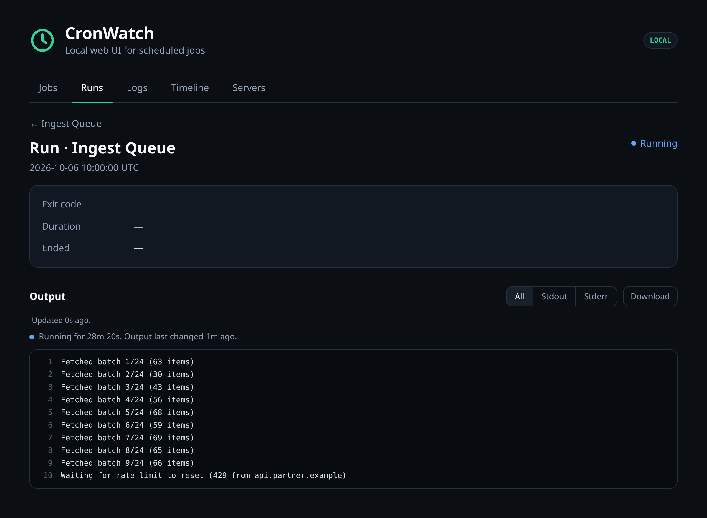

# CronWatch

**Know what ran, what failed, and what never started.**

CronWatch wraps scheduled commands and records their results in a local SQLite
database. A small web dashboard shows job status, run history, duration, and
captured logs. It ships as one Go binary and needs no account or daemon to
record runs. For several servers, each can send a job summary to a hub while
keeping its full run history and logs locally.


[Install](#install) · [Quick start](#quick-start) · [Command map](#command-map) · [CLI](#cli) · [Multiple servers](#multiple-servers) · [Development](#development)

Cron decides when to start your work. `cronwatch run` wraps the command and
records what happened; `cronwatch ping` lets a script report its own start
and result. `cronwatch serve` opens the read-only dashboard and checks for
missed starts, overdue pings and alerts waiting for delivery. Run jobs and
the dashboard as the same user, or point them at the same data directory.

## Highlights

- **Drop-in command wrapper.** Add `cronwatch run` to an existing cron entry.
- **Guided setup for existing jobs.** `cronwatch sync --wrap` previews the
  changes; `--apply` installs them after saving a backup.
- **Useful failure detail.** Capture stdout, stderr, exit codes, and duration.
- **Works here, fails in cron?** Each run records its environment, so
  `cronwatch envdiff` shows what cron's `PATH`, shell, or directory lacks, and
  `cronwatch try` reruns the job the way cron ran it.
- **Missed-run detection.** A five-field cron schedule and grace period show
  when a job did not start on time.
- **Failures your exit codes miss.** Mark runs failed when output matches a
  pattern or a run takes too long, and keep overlapping runs from piling up.
- **Alerts without new dependencies.** Send ntfy, Slack, Discord, Telegram or
  webhook alerts when a job starts failing or recovers, run any command of
  your own, or let cron email you a daily `cronwatch digest`.
- **Local by default.** SQLite storage and a dashboard bound to
  `127.0.0.1:8765`; SSH forwarding covers remote servers.
- **Several servers in one view.** Authenticated reports feed a hub's
  **Servers** tab, with stale reports clearly marked. Full logs stay on
  each server.
- **Single binary.** HTML, CSS, JavaScript, and database migrations are embedded.

## Install

The installer downloads the latest release for Linux or macOS, checks its
SHA-256 digest, and installs CronWatch into `~/.local/bin` without sudo:

```sh
curl -fsSL https://github.com/yeboahd24/cronwatch/releases/latest/download/install.sh | sh
```

Set `CRONWATCH_INSTALL_DIR` to choose another user-owned directory. Ensure the
install directory is on your `PATH`.

To build from source instead, use Go 1.26 or newer:

```sh
go build -o cronwatch ./cmd/cronwatch
```

## Quick start

Wrap a command and start the dashboard:

```sh
cronwatch run --name "Database Backup" --schedule "0 2 * * *" --grace 10m -- ./backup.sh
cronwatch serve
```

Open <http://localhost:8765>. A command that exits nonzero also makes
`cronwatch run` exit with that code, so existing cron behavior is preserved.

For a remote server, keep the dashboard on its default loopback address and
forward the port from your workstation:

```sh
ssh -L 8765:localhost:8765 user@server
```

Then open <http://localhost:8765> on the workstation. The browser can inspect
jobs and logs; it cannot execute commands.

### Dashboard

- **Jobs** lists every job with its status, last run, duration, and next
  expected run, and refreshes every 10 seconds. Below it, **Recent logs** shows
  the end of the latest failing run's output (or the latest run when nothing
  is failing). Lines the command wrote to stderr are shown in red.
- **Runs** lists runs across all jobs, newest first, 100 to a page; **Older**
  goes further back. Filter by job, status and the days runs started (in local
  time). The filters are in the URL, so a filtered list can be bookmarked, and
  each job's page links to its own runs. A running run's page shows its
  output so far and updates it every few seconds, with how long it has been
  running and when its output last changed; a run with no new output for 10
  minutes is pointed out, as it may be stuck. A run's page shows its last error,
  and its output opens at the end, with All / Stdout / Stderr views. Below the
  output is the environment the run started in. When a run fails and its
  environment differs from the last successful run's, a notice at the top
  lists what changed. A failed run also has a **vs last success** view: the
  lines that are new in this run, the lines from the last success that are
  missing, and how the exit code and duration changed. Lines are matched
  ignoring numbers, times, IDs and `/tmp` paths, so a changed date or size is
  not reported as a difference.
- **Durations.** The jobs list and each job's page show a bar chart of recent
  run durations. A successful run that takes more than 3× the median of the
  job's previous 20 successful runs (and at least 10 seconds longer) is marked
  **slow**. A job's page also says when it is **getting slower**: its median
  over the last 7 days is 40% or more above the 30 days before (and at least
  10 seconds more).
- **Failure types.** Failed runs that end with the same error are grouped, by
  their last few stderr lines (or output, if stderr is empty) with numbers,
  times, IDs and `/tmp` paths ignored. A failed run's page says whether its
  error is **new** or how many earlier runs failed the same way and when it
  was first seen; a job's page lists each failure type with its count, first
  and last time.
- **Logs** searches the output of finished runs, with the same job, status
  and date filters as Runs. Each page holds the newest 50 runs whose output
  matches, and **Older** continues with the next 50. **Errors only** then
  keeps only their stderr lines, so a page can show fewer runs; the note under
  the results says how many matched and how many are shown. A run's page has a **Download** link for its
  output as a `.log` file (the whole output, or the stream you are viewing).
- **Timeline** shows every job's runs over the last 24 hours or 7 days, one row
  per job, with expected run times and missed runs, so failures, gaps and jobs
  that run at the same time stand out. Hover a mark for details; click it to
  open the run.

A run's page also shows why a run counts as failed when its exit code alone
does not say (see [Deciding success](#deciding-success)), its peak memory and
CPU time, and whether it started while an earlier run was still going.





These screenshots use made-up demo data; `sh scripts/screenshots.sh`
regenerates them.

### Cron example

Take an existing cron entry:

```cron
0 2 * * * /opt/scripts/backup.sh
```

and put `cronwatch run ... --` in front of the command:

```cron
0 2 * * * $HOME/.local/bin/cronwatch run --name "Database Backup" --schedule "0 2 * * *" --grace 10m -- /opt/scripts/backup.sh
```

The line has two schedules, and they do different jobs:

```text
0 2 * * *  $HOME/.local/bin/cronwatch run  --name "Database Backup"  --schedule "0 2 * * *"  --grace 10m  --  /opt/scripts/backup.sh
└───┬───┘  └─────────────┬──────────────┘  └──────────┬───────────┘  └─────────┬──────────┘  └────┬────┘  │   └─────────┬──────────┘
    1                    2                            3                        4                  5       6             7
```

1. **Cron's schedule.** Cron reads this to decide *when to run* the line:
   02:00 every day. CronWatch does not change it.
2. **The wrapper.** Cron starts CronWatch, which starts your command and
   records the result. Use the full path, because cron's `PATH` is minimal.
3. **The job name** shown on the dashboard.
4. **CronWatch's copy of the schedule.** It tells CronWatch *when to expect a
   run*, so it can show the next expected time and flag a run that never
   started. Keep it identical to (1).
5. **Grace period.** How late a run may start before it counts as missed.
   Default 5m.
6. **`--`** ends CronWatch's flags; everything after it is your command.
7. **Your command**, exactly as it was before.

You can leave out `--schedule`: while `cronwatch serve` is running, it reads
your crontab and takes the schedule from (1). Pass `--schedule` when you don't
run `serve`, or when you want the expectation written next to the command.

Shell redirects after the command still work, because CronWatch passes the
command's output through:

```cron
0 2 * * * $HOME/.local/bin/cronwatch run --name "Database Backup" -- /opt/scripts/backup.sh >> $HOME/backup.log 2>&1
```

The cron entry and dashboard must run under the same user to see the same
database. A user-level systemd service example is in
[`examples/cronwatch.service`](examples/cronwatch.service).

## Command map

This map explains every command and how to navigate the dashboard. Use it to
choose where to start, then follow the [CLI reference](#cli) for examples
and flags. [Open the full-size image](docs/images/cronwatch-command-map.png)
to read the details.


## CLI

| Command | Purpose |
| --- | --- |
| [`cronwatch run`](#cronwatch-run) | Run a command and record the result |
| [`cronwatch serve`](#cronwatch-serve) | Serve the local dashboard |
| [`cronwatch jobs`](#cronwatch-jobs) | List jobs and their current status |
| [`cronwatch runs`](#cronwatch-runs) | List recent runs |
| [`cronwatch sync`](#cronwatch-sync) | Register jobs from your crontab, and wrap unmonitored lines |
| [`cronwatch pause`, `resume`, `archive`](#cronwatch-pause-resume-and-archive) | Stop and restart monitoring a job, keeping its history |
| [`cronwatch envdiff`](#cronwatch-envdiff) | Compare a run's environment with your shell |
| [`cronwatch try`](#cronwatch-try) | Rerun a job in the environment cron gave it |
| [`cronwatch digest`](#cronwatch-digest) | Summarize every job, for a daily email |
| [`cronwatch crontab-history`](#cronwatch-crontab-history) | List changes to your crontab |
| [`cronwatch ping`](#cronwatch-ping) | Record a run of a job you cannot wrap |
| [`cronwatch check`](#cronwatch-check) | One status line and exit code for monitoring systems |
| [`cronwatch doctor`](#cronwatch-doctor) | Check the setup and explain what is wrong |
| [`cronwatch hosts`](#multiple-servers) | Add and remove the servers that report to a hub |
| [`cronwatch report`](#multiple-servers) | Send this server's jobs to its hub once |
| [`cronwatch timers`](#cronwatch-timers) | List systemd timers and their last results |
| [`cronwatch notify`](#sending-to-chat-and-push-services) | Send a hook's alert to ntfy, Slack, Discord, Telegram or a webhook |
| [`cronwatch prune`](#cronwatch-prune) | Delete old finished runs |
| [`cronwatch version`](#cronwatch-version) | Print the version |

Run `cronwatch COMMAND --help` (or `cronwatch help COMMAND`) for a command's
flags. Every command except `version` accepts `--data-dir DIR` to choose the
database directory. The `CRONWATCH_DATA_DIR` environment variable sets the default,
which is otherwise `~/.config/cronwatch` on Linux. Flags go before any
positional argument, e.g. `cronwatch runs --data-dir DIR database-backup`.

### `cronwatch run`

```sh
cronwatch run --name NAME [flags] -- command [args...]
```

Runs the command, shows its output as usual, and records the run. CronWatch
exits with the command's exit code, so cron and scripts see the same result as
before.

```console
$ cronwatch run --name "Database Backup" --schedule "0 2 * * *" --grace 10m -- /opt/scripts/backup.sh
Dumping database...
Backup written to /backups/db.sql.gz
```

| Flag | Meaning |
| --- | --- |
| `--name NAME` | Job name shown on the dashboard. Required. |
| `--slug SLUG` | Stable ID for the job. Defaults to the name in lowercase with dashes (`database-backup`). |
| `--schedule "EXPR"` | Five-field cron expression CronWatch should expect the job on, or `@hourly`, `@daily`, `@weekly`, `@monthly` or `@yearly`. Prefix it with `CRON_TZ=Area/City ` to read it in another time zone than the server's. |
| `--grace DURATION` | How late a run may start before it counts as missed, e.g. `10m`. Default `5m`. |
| `--max-log-bytes N` | Output kept per stream. Default 1 MiB, maximum 64 MiB. |
| `--no-echo` | Record output without also printing it. |
| `--ok-codes 3,4` | Exit codes besides 0 that count as success. |
| `--fail-on-stderr` | Mark the run failed if the command writes anything to stderr. |
| `--fail-if-match REGEXP` | Mark the run failed if its output matches, e.g. `'ERROR\|Traceback'`. |
| `--success-if-match REGEXP` | Mark the run failed unless its output matches, e.g. `'Backup complete'`. |
| `--timeout DURATION` | Stop the command after this long (SIGTERM, then SIGKILL 5s later) and record `timeout`. |
| `--strict-exit` | Exit 0 for a successful run and nonzero for a failed one, even when the rules above disagree with the command's exit code. |
| `--no-overlap` | Skip the run, and record it as `skipped`, if the job's previous run is still running. |
| `--on-failure 'CMD'` | Shell command to run when the job starts failing. See [Notifications](#notifications). |
| `--on-recover 'CMD'` | Shell command to run when the job succeeds again after failing. |
| `--notify URL` | Send failure and recovery alerts to a chat or push service; repeat for more. See [Sending to chat and push services](#sending-to-chat-and-push-services). |
| `--on-storage-error fail\|run` | What to do when the run cannot be recorded. See [When recording fails](#when-recording-fails). |

`--schedule` and `--grace` only change the stored job when you pass them, so
running a job by hand to test it does not reset its schedule.

When output exceeds `--max-log-bytes`, CronWatch keeps the first and last half
and replaces the middle with a marker, so the error at the end of a failing job
is kept.

While the command runs, CronWatch also saves its output so far, kept within the
same limit, every 5 seconds when there is new output (every 30 seconds once it
is over 1 MiB). A long or stuck job can be looked at on the dashboard before it
ends, and a run whose `cronwatch` process is killed keeps the output it had
reached. The final output replaces it when the run ends. Treat stored logs as sensitive: command output may contain secrets.

Each run also records the environment it started in: the working directory,
the user, the names of all environment variables, and the values of `PATH`,
`HOME`, `SHELL`, `USER`, `LOGNAME`, `TZ`, `TMPDIR`, `LANG`, `LANGUAGE` and
`LC_*`. Other values are not stored, because they may hold secrets. Identical
environments are stored once.

Different names that produce the same slug share one job; CronWatch prints a
warning when that happens, and `--slug` keeps them apart.

Each run also records its peak memory and CPU time.

#### Deciding success

Many scripts exit 0 when they fail. `--ok-codes`, `--fail-on-stderr`,
`--fail-if-match` and `--success-if-match` let the output decide instead.
These rules see all of the output as the command writes it, before
`--max-log-bytes` drops anything, so an `ERROR` in the dropped middle of a long
log still fails the run. Patterns are Go regular expressions
([RE2 syntax](https://github.com/google/re2/wiki/Syntax)) matched against one
line of stdout or stderr at a time, without the newline or a trailing `\r`:
`^` and `$` anchor to the line, and a pattern never matches across lines. A
line longer than 64 KiB is matched in 64 KiB pieces. `--fail-if-match` fails
the run if any line matches; `--success-if-match` needs at least one line to
match. When a rule marks a run failed, CronWatch prints why on stderr, and the
run page shows it:

```console
$ cronwatch run --name "Database Backup" --fail-if-match 'ERROR' -- ./backup.sh
ERROR: disk full
cronwatch: failed: output matched --fail-if-match "ERROR": ERROR: disk full
```

By default `cronwatch run` still exits with the command's own code, so cron
behaves exactly as before. Add `--strict-exit` to make the exit code follow the
recorded status instead.

`--timeout` records the run as `timeout` and exits with the command's code
(143 for SIGTERM). `--no-overlap` exits 0 when it skips a run.

CronWatch notices overlapping runs even without `--no-overlap`: a run that
starts while the job's previous run is still going is marked on its page and
outlined on the timeline.

#### When recording fails

Before starting the command, `cronwatch run` takes the job's lock, opens the
database, registers the job and records the run's start. If any of that fails
(an unreadable config, a full disk, a broken database), `--on-storage-error`
decides what happens:

- `fail` (the default): the command does not run. CronWatch prints the error
  and exits 1, so cron mails you about it.
- `run`: CronWatch prints a warning and runs the command anyway. Its output
  passes through, `--timeout` and the success rules apply, and it exits as it
  would have, but nothing is recorded and no hooks run, because whether the job
  changed state cannot be known.

`--no-overlap` is kept even when the run is not recorded. The lock is a file in
the data directory, taken before the database is opened. If another run holds
it, the run is skipped and CronWatch exits 0, as usual. If the lock itself
cannot be taken, CronWatch cannot tell whether another run is going, so the
command does not run and CronWatch exits 1.

If the command runs but its result cannot be saved, `fail` reports the error and
exits 1; `run` prints a warning and exits with the command's own code. The
unfinished run is marked failed later, once CronWatch sees its process has
gone.

Set `CRONWATCH_ON_STORAGE_ERROR=run` at the top of a crontab to apply it to
every job; a flag on a line takes precedence.

#### Notifications

`--on-failure` runs a shell command when a job goes from OK to failing: a
failed run, a timeout, or a missed scheduled run. `--on-recover` runs one when
it succeeds again. A job that keeps failing alerts once, not on every run. The
command gets the details in environment variables:

| Variable | Value |
| --- | --- |
| `CRONWATCH_EVENT` | `failed`, `timeout`, `missed` or `recovered` |
| `CRONWATCH_JOB_NAME`, `CRONWATCH_JOB_SLUG` | The job |
| `CRONWATCH_STATUS`, `CRONWATCH_EXIT_CODE` | The run's status and exit code. The exit code is unset when there is none: a missed run, or a pinged run that timed out waiting for its end ping |
| `CRONWATCH_REASON` | Why a rule marked the run failed, if one did |
| `CRONWATCH_LAST_ERROR` | The last line the command wrote to stderr |
| `CRONWATCH_RUN_ID`, `CRONWATCH_STARTED_AT` | The run, for `/runs/RUN-ID` on the dashboard |
| `CRONWATCH_EXPECTED_AT` | For `missed`: when the run was due |
| `CRONWATCH_HOST` | This machine's hostname |

To alert on every job, set `CRONWATCH_ON_FAILURE` (and `CRONWATCH_ON_RECOVER`)
at the top of your crontab instead of repeating the flag. A flag on a line
takes precedence. Cron does not expand variables in these assignments, so the
`$CRONWATCH_…` references reach the hook as written and are filled in when it
runs. On a command line, single-quote the hook for the same reason, and escape
any `%` as `\%`, because cron treats `%` in a command as a newline.

```cron
CRONWATCH_ON_FAILURE=curl -fsS -d "$CRONWATCH_JOB_NAME $CRONWATCH_EVENT: $CRONWATCH_LAST_ERROR" https://ntfy.sh/my-cron-alerts
```

##### Sending to chat and push services

`--notify URL` sends a job's failure and recovery alerts to a chat or push
service, with no `curl` or quoting of your own. Repeat it to send to more than
one. To alert on every job, set `CRONWATCH_NOTIFY` at the top of your crontab
to one or more space-separated URLs:

```cron
CRONWATCH_NOTIFY=https://ntfy.sh/my-cron-alerts https://hooks.slack.com/services/T000/B000/XXXX
```

`--notify` sets the `--on-failure` and `--on-recover` hooks to
`cronwatch notify URL...`, a command you can also use in a hook of your own.
`--on-failure` and `--on-recover` still take precedence for their own event,
and so do `CRONWATCH_ON_FAILURE` and `CRONWATCH_ON_RECOVER` over
`CRONWATCH_NOTIFY`; a line's `--notify` takes precedence over all of the
crontab's variables. A `CRONWATCH_NOTIFY` that is not a valid URL is a warning
and leaves the job's hooks as they were, so the job still runs.

The URL's host picks the service:

| URL | Sends |
| --- | --- |
| `https://ntfy.sh/TOPIC` | An ntfy notification, high priority for failures |
| `https://hooks.slack.com/services/...` | A Slack message |
| `https://discord.com/api/webhooks/...` | A Discord message |
| `https://api.telegram.org/botTOKEN/sendMessage?chat_id=CHAT` | A Telegram message; add `&message_thread_id=N` for a topic |
| Any other `http://` or `https://` URL | A JSON webhook: `event`, `title`, `message`, `job_name`, `job_slug`, `host`, `status`, `exit_code`, `reason`, `last_error`, `run_id`, `started_at`, `expected_at` |

For a self-hosted service, put its name before the scheme:
`ntfy+https://ntfy.example.com/TOPIC`, or `slack+https://` for a
Slack-compatible incoming webhook such as Mattermost's. An ntfy URL's user
and password are sent as basic auth; put an access token as the password,
`ntfy+https://:tk_TOKEN@ntfy.example.com/TOPIC`.

`cronwatch notify --test URL...` sends a test message to check a URL. Each
URL is tried; if any fails, the hook fails and the alert is retried, and a
retry sends to every URL again. These URLs hold tokens: they are stored with
the job like any hook, are not sent to a hub, and are left out of `notify`'s
error messages.

Hooks run after the result is recorded, with a 30-second limit, and the last
4 KiB of their output is kept. A hook that fails or times out never changes the
job's result. CronWatch prints the error on stderr, stores the alert, and
retries it: after 1 minute, then 2, 4 and so on up to an hour apart, for 12
attempts in all (about seven hours). A retry runs the job's current hook, so
fixing a broken hook command also fixes its waiting alerts. A job's alerts are
delivered in order: one waiting for a retry holds back the job's later
alerts. Retries happen on the job's next `cronwatch run` or `ping`, every
minute while `cronwatch serve` is running, and whenever `jobs`, `runs` or
`prune` checks for missed runs. Each attempt also gets
`CRONWATCH_ALERT_ID`, which stays the same across retries, and
`CRONWATCH_ATTEMPT`, which counts from 1, so a hook can ignore an alert it has
already sent.

The job page lists the job's alerts, with each one's delivery status and last
error, and the run page shows the alert the run raised. The jobs list flags
jobs with alerts that failed and have not been delivered.

Missed runs are detected by `cronwatch serve` (or `check`, `jobs`, `runs`,
`prune`), so their alerts need one of those running.

### `cronwatch serve`

```sh
cronwatch serve [--addr 127.0.0.1:8765]
```

Serves the dashboard at <http://127.0.0.1:8765>. It is read-only and has no
login, so it only listens on loopback; reach it from another machine with
`ssh -L 8765:localhost:8765 user@server`. Binding to another address requires
`--public`. While running, it also registers jobs from your crontab
([crontab sync](#crontab-sync)) and checks for missed runs every minute,
running `--on-failure` hooks for jobs that start missing runs and retrying
alerts that could not be delivered.

```console
$ cronwatch serve
CronWatch UI: http://127.0.0.1:8765
crontab sync: added Database Backup
crontab sync: added Ingest queue
```

It keeps running until you stop it; the `crontab sync` lines appear when new
crontab lines are registered.

`--metrics` also serves Prometheus metrics at `/metrics`, one series per job
(labelled `job="SLUG"`): `cronwatch_job_failing` and `cronwatch_job_missed`
(1 or 0), `cronwatch_job_last_run_timestamp_seconds`,
`cronwatch_job_last_run_duration_seconds`, `cronwatch_job_last_run_exit_code`,
`cronwatch_job_last_success_timestamp_seconds`,
`cronwatch_job_next_expected_timestamp_seconds`, and `cronwatch_job_info`
(always 1, with the name, schedule and status as labels). An alert such as
`time() - cronwatch_job_last_success_timestamp_seconds > 86400` catches a job
that has not succeeded for a day. Metrics follow the same loopback rule as
the dashboard.

To start it at boot from cron:

```cron
@reboot /usr/bin/flock -n $HOME/.cache/cronwatch-serve.lock $HOME/.local/bin/cronwatch serve >> $HOME/.cache/cronwatch-serve.log 2>&1
```

### `cronwatch jobs`

Lists every job with its current status. Archived jobs are left out unless
you pass `--all`:

```console
$ cronwatch jobs
NAME              STATUS     LAST RUN          DURATION
Database Backup   success    2026-10-02 02:00  42s
Generate Reports  failed     2026-10-02 01:00  800ms
Queue worker      never_run  —                 —
```

Statuses: `success`, `failed`, `timeout`, `running`, `cancelled`, `skipped`
(by `--no-overlap`), `missed` (a scheduled run never started), `never_run`,
`invalid_schedule`, and `paused` and `archived` (see
[pause, resume and archive](#cronwatch-pause-resume-and-archive)).

`--json` prints the jobs as JSON for scripts. Field names are stable, times are
RFC 3339 in UTC, and missing values are `null`:

```console
$ cronwatch jobs --json
[
  {
    "slug": "database-backup",
    "name": "Database Backup",
    "status": "failed",
    "schedule": "0 2 * * *",
    "grace_seconds": 300,
    "max_duration_seconds": null,
    "paused_until": null,
    "archived_at": null,
    "last_run": {
      "id": "fa46bf4ecf0a55ec3b1289236bca48e5",
      "job": "Database Backup",
      "job_slug": "database-backup",
      "status": "failed",
      "started_at": "2026-10-05T02:00:01.995990733Z",
      "ended_at": "2026-10-05T02:00:42.997502931Z",
      "duration_ms": 41001,
      "exit_code": 1
    },
    "next_expected_at": "2026-10-06T02:00:00Z",
    "missed_at": null
  }
]
```

`cronwatch runs --json` and `cronwatch sync --json` work the same way.

### `cronwatch runs`

Lists the most recent runs, newest first, optionally for one job by its slug.
`--status failed` lists runs with one status, `--since 24h` only recent ones,
and `--limit N` changes how many are listed (100 by default, 0 for all):

```console
$ cronwatch runs database-backup
RUN ID                            JOB              STATUS   STARTED
9b56e10bd024da121ddce143fd49270c  Database Backup  success  2026-10-02 02:00:01
```

Open a run's output on the dashboard at `/runs/RUN-ID`.

### `cronwatch sync`

```sh
cronwatch sync [--crontab FILE]
cronwatch sync [--crontab FILE] --wrap [--lines N,...] [--cronwatch PATH] [--apply]
cronwatch sync [--crontab FILE] --backups | --restore latest|NAME
```

Registers the jobs in your crontab (`crontab -l`, or `FILE`) so they appear on
the dashboard before their first run, and lists lines that are not monitored:

```console
$ cronwatch sync
Added    Queue worker

2 jobs in the crontab, all registered.

Not monitored (1 line without cronwatch run):
  line 3: 30 4 * * 0 docker system prune -f
```

When everything is covered it prints
`8 jobs in the crontab, all registered. Every crontab line is monitored.`
`cronwatch serve` runs the same sync every minute, so you rarely need this by
hand. See [crontab sync](#crontab-sync).

#### Wrapping existing jobs

You do not have to edit every line by hand. `--wrap` shows how the lines that
do not use cronwatch would look wrapped with `cronwatch run`, as a diff, and
changes nothing:

```console
$ cronwatch sync --wrap
Would wrap 2 lines with cronwatch run:

  line 3: backup
  line 5: report

--- crontab
+++ crontab (wrapped)
@@ -2,4 +2,4 @@
 # nightly
-0 2 * * * /usr/local/bin/backup.sh >> /var/log/backup.log 2>&1
+0 2 * * * cronwatch run --name backup -- /usr/local/bin/backup.sh >> /var/log/backup.log 2>&1
 */5 * * * * cronwatch run --name "Ingest queue" -- bash ingest.sh
-30 4 * * 0 cd /srv/app && ./report.py >> /var/log/report.log
+30 4 * * 0 cronwatch run --name report -- sh -c 'cd /srv/app && ./report.py' >> /var/log/report.log

To make this change, run the same command with --apply. The crontab is backed up first.
```

Add `--apply` to make the change. CronWatch first saves an exact copy of the
current crontab in the data directory, then installs the new one with
`crontab -` (or writes `FILE`) and registers the new jobs. It prints the
command that undoes it. `--lines 3,5` wraps only those lines.

How a line is wrapped:

- A single command gets `cronwatch run --name NAME --` in front. Its
  redirections now apply to cronwatch, which passes the output through, so
  the log file still gets it and CronWatch records it.
- Anything else runs with `sh -c '…'`. When only setup commands such as
  `cd /srv/app &&` come before the main one, its redirections move outside
  `sh -c` so CronWatch records its output too. Otherwise the line is kept
  whole, so its output goes where it did before, which may leave CronWatch
  little to record.
- A line that uses `%` to pass input to its command is left alone, because
  cron splits the line at `%` even inside quotes. Wrap it by hand.
- The name is the program or script the line runs, such as `backup` for
  `backup.sh`, skipping `cd`, `nice`, `env` and interpreters such as
  `python3`. A name already used by a line or an existing job gets a number.
  Edit the names in the crontab afterwards if you like; a new name starts a
  new job.
- Wrapped lines call cronwatch as the crontab's other cronwatch lines do (such
  as `$CW`), else as `cronwatch` if it is on the crontab's `PATH`, else by its
  full path. `--cronwatch PATH` overrides this.

`--backups` lists the backups of the crontab, oldest first, and
`--restore latest` (or a name from the list) puts one back, after backing up
the crontab it replaces. Each crontab has its own backups, so a backup of a
`--crontab FILE` is never restored as your crontab. Backups are exact copies
and may hold secrets; they are readable only by you. Restoring your crontab
unschedules the jobs that wrapping registered, as for any line removed from it
(see [crontab sync](#crontab-sync)); they stay on the dashboard with their
runs.

### `cronwatch envdiff`

```sh
cronwatch envdiff [--last-success] [--all] JOB-SLUG
cronwatch envdiff [--last-success] [--all] --run RUN-ID
```

Explains why a command works in your shell but fails under cron. It compares
the environment of the job's latest run (or `--run`) with the shell you run
`envdiff` in:

```console
$ cronwatch envdiff database-backup
Comparing run 0486399e (2026-10-02 02:00, failed) of Database Backup with this shell.

PATH
  run:   /usr/bin:/bin
  shell: /home/me/.local/bin:/usr/local/bin:/usr/bin:/bin
  Missing from run: /home/me/.local/bin, /usr/local/bin
SHELL
  run:   /bin/sh
  shell: /usr/bin/zsh
Set only in shell: NVM_DIR, SSH_AUTH_SOCK
Set only in run: MAILTO
41 terminal or desktop session variables not shown (--all lists them).

Values of other variables are not recorded, so changes to them are not shown.
```

`--last-success` compares the run with the job's last successful run instead,
which shows what changed when a job that used to work starts failing.
Variables whose values are not recorded are compared by name only.

### `cronwatch try`

```sh
cronwatch try [--env NAME=VALUE]... JOB-SLUG
cronwatch try [--env NAME=VALUE]... --run RUN-ID
```

Runs the job's command now, from your terminal, in the environment of its
latest run: the same working directory and only the recorded variables, with
the command looked up on that run's `PATH`. Use it to reproduce a cron failure
and to check a fix without waiting for the next scheduled run:

```console
$ cronwatch try database-backup
cronwatch: trying Database Backup with the environment of run 0486399e (2026-10-02 02:00, failed)
cronwatch: directory /home/me, PATH=/usr/bin:/bin
cronwatch: not set, because their values are not recorded: MAILTO
cronwatch: backup.sh: command not found with this PATH
```

A job that has no recorded run yet gets cron's defaults (`PATH=/usr/bin:/bin`,
`SHELL=/bin/sh`, the home directory). The run is not recorded, and `try` exits
with the command's exit code. Variables whose values are not recorded, such as
ones set at the top of the crontab, are not set. Pass any the job needs with
`--env NAME=VALUE` (repeatable); `FOO=bar cronwatch try` does not work,
because `try` replaces the environment.

### `cronwatch digest`

```sh
cronwatch digest [--since DURATION] [--quiet]
```

Prints a plain-text summary: the jobs that need attention now, and each job's
runs, failures and missed runs over the period (default `24h`):

```console
$ cronwatch digest
CronWatch digest for nebula-rain, Oct 4 11:24 to Oct 5 11:24

Needs attention (2)
  Database backup: failed Oct 5 02:00 (exit 1)
  Tile staleness check: missed the run expected Oct 5 07:00

JOB                   STATUS   RUNS  FAILED  MISSED  LAST RUN
Database backup       failed   1     1       0       Oct 5 02:00
Docker prune          success  0     0       0       Oct 4 04:30
Ingest queue          running  46    4       2       Oct 5 11:00
Report export         success  4     0       0       Oct 5 06:00
Tile staleness check  missed   0     0       1       Oct 3 07:00
```

Cron emails a job's output to `MAILTO`, so a crontab line is enough for a daily
report. With `--quiet` it prints nothing, and cron sends nothing, unless a job
failed, timed out or missed a run in the period, or is failing now:

```cron
MAILTO=you@example.com
0 8 * * * $HOME/.local/bin/cronwatch digest --quiet
```

### `cronwatch crontab-history`

```sh
cronwatch crontab-history [--limit N] [JOB-SLUG]
```

Lists changes to your crontab, newest first, optionally for one job. `cronwatch
serve` checks your crontab every minute and `cronwatch sync` checks it when you
run it; each time it has changed, CronWatch keeps a copy and records what
changed:

```console
$ cronwatch crontab-history
2026-10-05 09:12
  Database Backup: schedule changed from 0 2 * * * to 0 3 * * *
  + MAILTO=you@example.com

2026-10-04 18:40
  Ingest queue: removed from the crontab (was: */5 * * * * $CW run --name "Ingest queue" -- ./ingest.sh)
```

A job's page shows its own changes under **Crontab history**, and the
Timeline marks them, so a schedule change sits next to the gap it caused.

The copies are stored in the database, so treat them like the logs. Values of
variables whose names look secret (containing `KEY`, `TOKEN`, `SECRET`,
`PASS`, `AUTH` and similar) are replaced by a short hash: a changed secret is
still noticed, but never stored. Secrets written inside commands are stored as
written. `sync --crontab FILE` registers jobs from the file without recording
it, and `prune --older-than` deletes old copies but always keeps the newest.

### `cronwatch ping`

```sh
cronwatch ping [--start | --fail] [--message TEXT] [--exit-code N] [--max-duration DURATION] JOB-SLUG
```

Records a run of a job that cannot be wrapped with `cronwatch run`, such as a
step inside a long script or a job started by another scheduler. A ping
records a successful run. Ping with `--start` when the work begins and without
it when it ends, and the run's duration is measured between the two:

```sh
cronwatch ping --start nightly-etl
./extract && ./transform && ./load \
  && cronwatch ping --message "loaded $ROWS rows" nightly-etl \
  || cronwatch ping --fail --message "ETL failed" nightly-etl
```

The job is created on its first ping; pass `--name`, `--schedule` and
`--grace` to name it and to have missed pings detected. Hooks, failure types
and the dashboard treat pinged runs like wrapped ones.

A `--start` that never gets its end ping stays **running** until the next
`--start`, which records it as failed. Pass `--max-duration` to stop waiting
sooner: a run that goes longer than that without its end ping is recorded as
**timed out**, and `--on-failure` runs with `CRONWATCH_EVENT=timeout`, without
waiting for the job to run again. `cronwatch serve` checks every minute, and
`check`, `jobs`, `runs`, `prune` and the job's own pings check too, so the
result is the same whichever notices first. Something has to be running to
notice a ping that never comes: run `cronwatch serve`, or, without it,
schedule `cronwatch check` from your monitor or from cron
(`* * * * * cronwatch check >/dev/null`). Missed runs are detected the same
way. An end ping that arrives after the run timed out records a separate run.
The limit is kept on the job like `--schedule`: pass it once, and
`--max-duration 0` removes it.

```sh
cronwatch ping --start --max-duration 2h nightly-etl
```

A machine without CronWatch can ping a hub over HTTP; see
[Pinging the hub over HTTP](#pinging-the-hub-over-http).

### `cronwatch check`

```sh
cronwatch check [JOB-SLUG...]
```

Prints one status line and exits like a Nagios plugin, for Nagios, Icinga,
Zabbix or any monitor that runs a command: 0 OK; 1 WARNING (a last run was
unusually slow, or a job is getting slower); 2 CRITICAL (a job failed, timed
out, missed a run or has an impossible schedule); 3 UNKNOWN. It checks every
job unless given slugs. The text after `|` is performance data, and each
problem gets a line of its own:

```console
$ cronwatch check
CRONWATCH CRITICAL - Database Backup failed | jobs=2 critical=1 warning=0 ok=1 paused=0
CRITICAL: Database Backup: failed 2026-10-05 02:00: pg_dump: connection refused
$ echo $?
2
```

Over SSH, a remote monitor can run
`ssh server .local/bin/cronwatch check` and use its exit code.

### `cronwatch doctor`

```sh
cronwatch doctor [--data-dir DIR]
```

Checks CronWatch's setup and says what to do about anything wrong. Run it
when jobs do not show up, missed runs are not reported, or alerts do not
arrive:

```console
$ cronwatch doctor
CronWatch 0.1.0 doctor

User
  ✓ Running as deploy (uid 1000), home /home/deploy

Data
  ✓ Data directory /home/deploy/.config/cronwatch (the default)
  ✓ Database /home/deploy/.config/cronwatch/cronwatch.db: 348 KB, 6 jobs, 308 runs, the oldest from 2026-08-27

Crontab
  ✓ 5 scheduled lines, 4 run through cronwatch run
  ✗ Line 4 records to /srv/cronwatch, not /home/deploy/.config/cronwatch, which this doctor (and serve, run the same way) reads
      Set CRONWATCH_DATA_DIR in the crontab to match, or pass the same --data-dir to cronwatch commands.
  ! 1 line is not monitored: line 7
      cronwatch sync --wrap shows how to wrap them.

Missed-run detection
  ✗ Missed runs have never been checked, so they are not reported
      Run cronwatch serve (for example as a systemd user service), or schedule: * * * * * cronwatch check >/dev/null

Jobs and alerts
  ✓ 6 jobs, 2 with an --on-failure or --on-recover hook

2 problems, 1 warning.
```

It checks:

- **User**: who you are, and a warning if you are root, whose data directory
  is not the one your own crontab's jobs record to.
- **Data**: the data directory and where its path came from (`--data-dir`,
  `$CRONWATCH_DATA_DIR` or the default), its owner and permissions, free disk
  space, and that the database opens and passes SQLite's quick integrity check.
  It never creates the data directory.
- **Crontab**: that cron can find each line's `cronwatch` on the crontab's
  `PATH`, that each line records to this data directory (a
  `CRONWATCH_DATA_DIR` set in your shell but not in the crontab is a common
  reason jobs never appear), and which lines are not monitored.
- **Missed-run detection**: whether a cron daemon and a `cronwatch serve` for
  this data directory are running (on Linux), and when missed runs were last
  checked. `serve` checks every minute; `check`, `jobs`, `runs` and `prune`
  check too.
- **Jobs and alerts**: paused and archived jobs, jobs without a schedule, and
  alerts that could not be delivered.

✗ marks a problem, ! a warning and · a note. `doctor` exits 1 if it finds a
problem, so it can run in scripts.

### `cronwatch pause`, `resume` and `archive`

```sh
cronwatch pause [--for DURATION] JOB-SLUG...
cronwatch resume JOB-SLUG...
cronwatch archive JOB-SLUG...
```

Stop monitoring a job without losing its history, for maintenance, a job you
turned off for a while, or one you removed for good:

```console
$ cronwatch pause --for 4h nightly-backup
Paused Nightly backup until 2026-10-06 14:00.
$ cronwatch archive old-report
Archived Old report. Its runs are kept; resume it to monitor it again.
```

A paused job is not checked for missed runs and raises no alerts, but its
runs and pings are still recorded. Its status is **Paused**, which `check`,
metrics and the digest never count as a problem. With `--for` it resumes by
itself; otherwise it stays paused until `cronwatch resume`. Missed runs are
checked from the moment it resumes, so the time it was paused is never
reported as missed. Alerts that were already waiting to be delivered are
still delivered.

An archived job is paused and also left off the jobs list, `jobs`, `check`,
the digest, the timeline and metrics. The dashboard lists archived jobs under
the jobs table, each with its job page and runs; `jobs --all` and
`check JOB-SLUG` include them. `resume` brings back a paused or archived job.

A job whose line you remove from your crontab is unscheduled by
[crontab sync](#crontab-sync) without pausing or archiving it.

### `cronwatch timers`

```sh
cronwatch timers [--all] [--json]
```

Lists systemd timers, the other way Linux schedules jobs, read-only: system
timers and, when you have a user session, your own. `--all` includes inactive
and masked timers.

```console
$ cronwatch timers
TIMER                         SCHEDULE            CRON       LAST RUN          RESULT   NEXT RUN
fstrim.timer                  Mon *-*-* 00:00:00  0 0 * * 1  2026-10-05 01:04  success  2026-10-12 01:39
logrotate.timer               *-*-* 00:00:00      0 0 * * *  2026-10-05 00:00  success  2026-10-06 00:00
systemd-tmpfiles-clean.timer  OnBootUSec=15min    —          2026-10-04 21:45  success  —
```

CRON is the equivalent cron expression, when one exists. To monitor a timer
like a cron job, put `cronwatch run` in front of its service's `ExecStart`
and pass that expression as `--schedule`:

```ini
# systemctl edit logrotate.service
[Service]
ExecStart=
ExecStart=/usr/local/bin/cronwatch run --name logrotate --schedule "0 0 * * *" -- /usr/sbin/logrotate /etc/logrotate.conf
```

A service run by systemd records into the database of the user it runs as,
so set `CRONWATCH_DATA_DIR` (or `--data-dir`) to the directory your
dashboard reads.

### `cronwatch prune`

```sh
cronwatch prune [--keep N] [--older-than DURATION]
```

Deletes finished runs: `--keep N` keeps the newest N per job, and
`--older-than` deletes runs, missed-run records, crontab history and delivered,
undelivered or cancelled alerts older than a duration (`720h` is 30 days). At
least one is required. Running runs are never deleted.

```console
$ cronwatch prune --keep 200 --older-than 720h
Deleted 37 runs and 2 missed occurrences.
```

### `cronwatch version`

```console
$ cronwatch version
v0.2.2
```

## Multiple servers

One CronWatch can show the jobs of several servers. Each server pushes a
summary of its jobs to that CronWatch, the **hub**, every minute; the hub's
**Servers** tab shows every server, whether it is reporting, and all their
jobs, those needing attention first.

Servers push, so they need only outbound access to the hub and open no ports
themselves. Only the hub listens, on a port of its own that accepts reports,
and with `--accept-pings` [pings](#pinging-the-hub-over-http), and nothing
else; its dashboard stays on loopback as usual.

**1. On the hub**, add a host for each server. Each gets a token, shown once;
the hub keeps only its hash, and the token decides which host a report is
for, so one server cannot report as another:

```console
$ cronwatch hosts add web-1
Added host web-1.

Its token, shown only now:

  cwh_3q2…

On web-1, save it where only cronwatch's user can read it:
…
```

Then serve with a port for reports. They must arrive over HTTPS, so pass a
certificate and key; a self-signed pair will do:

```sh
openssl req -x509 -newkey ec -pkeyopt ec_paramgen_curve:P-256 -nodes -days 825 \
  -subj /CN=hub.example -addext subjectAltName=DNS:hub.example \
  -keyout hub.key -out hub.crt
cronwatch serve --hub-addr :8766 --hub-cert hub.crt --hub-key hub.key
```

Behind a reverse proxy that terminates TLS, give `--hub-addr` a loopback
address such as `127.0.0.1:8766` instead, without a certificate.

On a private network such as Tailscale or WireGuard, give `--hub-addr` the
hub's address on it, such as `100.78.211.74:8766`, so reports never cross the
internet, and include that IP in the certificate
(`-addext subjectAltName=IP:100.78.211.74`). If the address is not up yet when
`serve` starts, as at boot, `serve` runs as usual and keeps trying to listen
there every 10 seconds; a bad certificate or key stops it at once.

**2. On each server**, put the token in a file only CronWatch's user can read,
and report from `cronwatch serve`:

```sh
cronwatch serve --report-to https://hub.example:8766 --report-token-file ~/.config/cronwatch/hub-token
```

Add `--report-ca hub.crt` to trust a self-signed hub certificate. The token
can also come from `$CRONWATCH_REPORT_TOKEN`; it is never passed on the
command line, where other users could see it. A server without `serve` can
report from cron instead, after `cronwatch check` so missed runs are current:

```cron
* * * * * cronwatch check >/dev/null; cronwatch report --to https://hub.example:8766 --token-file ~/.config/cronwatch/hub-token
```

A report lists each job with its status, schedule, next expected run, missed
run, pause and undelivered alerts, and its last run's times, exit code,
reason and, for a failed run, the last line it wrote to stderr. No other
output leaves the server. Archived jobs are left out.


**What the hub shows.** A server that has not reported for 3 minutes is
**stale**: the hub says so, and its jobs are shown dimmed, as of its last
report, so old data never passes for current. One that never reported is
listed as such. `cronwatch hosts list` shows the same:

```console
$ cronwatch hosts list
NAME   STATUS      LAST REPORT  JOBS  VERSION
web-1  2 problems  12s ago      6     v0.10.0
web-2  stale       14m ago      3     v0.10.0
```

`cronwatch hosts token NAME` gives a host a new token, ending the old one at
once, and `cronwatch hosts remove NAME` deletes a host and its report. When
reports fail, `serve` logs it once, and again when they are delivered.

### Pinging the hub over HTTP

A machine without CronWatch, such as a NAS, a container or a CI runner, can
ping the hub with `curl`, as `cronwatch ping` would. Start the hub with
`--accept-pings` as well as `--hub-addr`, add a host for the machine, and
send its token:

```sh
cronwatch serve --hub-addr :8766 --hub-cert hub.crt --hub-key hub.key --accept-pings
```

```sh
TOKEN=$(cat ~/.config/cronwatch/hub-token)
HUB=https://hub.example:8766/api/v1/ping
curl -fsS -X POST -H "Authorization: Bearer $TOKEN" "$HUB/nightly-etl/start?name=Nightly%20ETL&schedule=0%202%20*%20*%20*"
./etl.sh > etl.log 2>&1
curl -fsS -H "Authorization: Bearer $TOKEN" --data-binary @etl.log "$HUB/nightly-etl/$?"
```

| Request | Records, like |
| --- | --- |
| `POST /api/v1/ping/SLUG` | `cronwatch ping SLUG`: a successful run |
| `POST /api/v1/ping/SLUG/start` | `cronwatch ping --start SLUG` |
| `POST /api/v1/ping/SLUG/fail` | `cronwatch ping --fail SLUG` |
| `POST /api/v1/ping/SLUG/CODE` | A run that exited with `CODE`, 0 to 255: failed unless it is 0 |

The body, up to 1 MiB, is recorded as the run's output, as `--message` is.
The query takes `name`, `schedule`, `grace` and `max_duration`, which set the
job like `ping`'s flags. Use `-X POST` when there is no body. The hub answers
204 when the ping is recorded, 400 with the reason when it is not, and 401
for an unknown token.

Pinged jobs are the hub's own: they are listed on its **Jobs** tab, with
missed runs, timeouts and alerts as for any job. Their alerts use the hooks
set in `serve`'s environment, such as `CRONWATCH_NOTIFY`; a ping cannot set a
hook. Any host's token can ping any job, so give a token only to machines you
would let report.

## Crontab sync

`cronwatch serve` reads your crontab (`crontab -l`) at startup and every
minute, and registers every job a line runs through `cronwatch run`. Jobs
appear on the dashboard as **Never run**, with their next expected time,
before their first run. A line without `--schedule` uses its own cron
schedule. Sync never deletes jobs, and it only corrects the schedule, grace
period and hooks of existing jobs; names and commands come from real runs.

When a job's line leaves your crontab, sync removes the job's schedule, so it
is no longer reported as missed. Its runs and history stay, and the dashboard
lists it without a schedule. If the line comes back, so does the schedule.
This only applies to jobs your crontab ran: a job scheduled with
`cronwatch run --schedule` or `ping --schedule` is left alone, and so is
everything when `sync --crontab FILE` reads a draft. While sync reports a
cronwatch line it cannot read, it removes no schedules, because that line may
be the job's.
Hooks come from the line's flags, or else from `CRONWATCH_ON_FAILURE` and
`CRONWATCH_ON_RECOVER` in the crontab; removing those removes the hooks.

Run `cronwatch sync` to do the same by hand. It also lists crontab lines that
are not wrapped with `cronwatch run`, so you can see what is not monitored,
and `cronwatch sync --wrap` offers to wrap them
([wrapping existing jobs](#wrapping-existing-jobs)).
Pass `--sync-crontab=false` to `serve` to turn this off, along with
[crontab history](#cronwatch-crontab-history).

## Retention

CronWatch does not delete runs on its own. Schedule `prune` to bound the
database, for example keeping the latest 200 runs per job and nothing older
than 30 days:

```cron
30 3 * * * $HOME/.local/bin/cronwatch prune --keep 200 --older-than 720h
```

Running runs are never pruned. `--older-than` also removes old missed-run
records.

## How missed runs work

CronWatch compares the configured schedule with recorded run start times. Once
an expected start passes its grace period, it is recorded as missed if no run
started between it and the next expected start. Every missed occurrence is
recorded, not just the latest. A job shows **missed** until a run starts.
Missed occurrences are tracked separately from command executions, so a
command that never started is not reported as a failed process. Schedules
follow the server's local time zone.

Detection runs every minute while `cronwatch serve` is running, and each time
`cronwatch jobs`, `runs`, or `prune` is invoked. Changing a job's schedule
starts detection from that moment. A cron expression that can never fire (such
as `0 0 30 2 *`) is rejected by `run`, and shows as `invalid_schedule`.

If a `cronwatch run` process is killed before it can record a result, the run
is marked `failed` with a note in its log once CronWatch sees the process is
gone.

## Development

```sh
go test ./...
go vet ./...
sqlc generate
```

Queries live in [`queries/`](queries/), generated Go code in
[`internal/db/`](internal/db/), and goose migrations in
[`migrations/`](migrations/). The build embeds migrations and web assets.

`sh scripts/screenshots.sh` regenerates the README screenshots from demo data
(`go run ./scripts/demo -data-dir DIR` builds that data on its own); it needs
Chromium or Google Chrome.

`sh scripts/release.sh VERSION` builds Linux and macOS archives plus checksums
and copies the publishable installer. See
[`examples/install-notes.md`](examples/install-notes.md) for the user-level
service setup.

## License

MIT. See [`LICENSE`](LICENSE).
